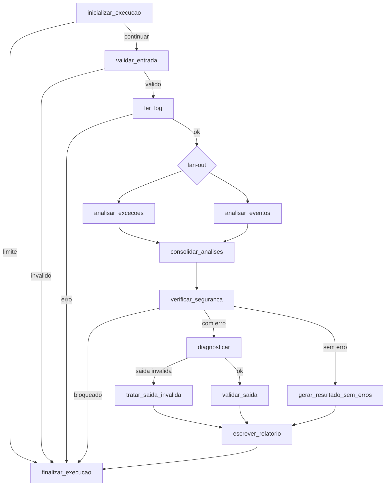

# JavaLog Agent

> Projeto avaliativo — Módulo 2: Agentes de IA e Automação

| Identificação | Informação |
|---|---|
| **Projeto** | JavaLog Agent |
| **Autor** | Edenilson Alves Gonçalves |
| **Curso** | SCTEC — IA para DEVs |
| **Turma** | Turma 1 |
| **Módulo** | Módulo 2 — Agentes de IA e Automação |

---

## 1. Descrição da solução

**JavaLog Agent** é um agente de diagnóstico para logs de aplicações **Java e
Spring Boot**.

**O problema.** Quando uma aplicação Java falha, o primeiro artefato disponível é
um log extenso, com centenas de linhas de ruído em torno de poucas linhas úteis.
Encontrar a exceção relevante, entender o que ela indica e escrever um resumo
aproveitável é trabalho manual, repetitivo e feito sob pressão — normalmente com
o serviço fora do ar.

**Para quem.** Pessoas desenvolvedoras que investigam a própria aplicação, times
de suporte que recebem o log antes de ter acesso ao sistema, e operação, que
precisa de uma triagem rápida antes de escalar o incidente.

**O objetivo.** Reduzir o tempo entre *"aqui está o log"* e *"é isto que está
acontecendo"*, com uma saída **estruturada** e sempre no mesmo formato.

**O valor.** O agente valida a entrada, lê o arquivo de forma confinada, extrai
exceções e eventos, classifica o problema, produz um diagnóstico e grava um
relatório em Markdown. E conclui **mesmo sem chave de modelo**: nesse caso, por
um caminho determinístico.

### Continuidade do miniprojeto

Este projeto **evolui o miniprojeto** do mesmo módulo, e não recomeça do zero. A
baseline trouxe o fluxo LangGraph inicial, a leitura confinada, a validação
determinística, a extração por expressão regular e o contrato do relatório —
tudo preservado. Foram **acrescentadas** as capacidades de memória por thread,
governança e limites de autonomia, observabilidade correlacionada, resiliência,
API HTTP, servidor MCP, integração contínua, detecção de anomalia e automação
low-code.

O que foi **mantido, refatorado, removido e acrescentado**, com os ciclos reais
de refinamento, está em
[`docs/evolucao-mini-projeto.md`](docs/evolucao-mini-projeto.md).

---

## 2. Classificação e arquitetura

**O sistema é híbrido.**

| Parte | Natureza |
|---|---|
| Validação, leitura, extração, classificação, política de autonomia, métricas e sinais | **determinística** |
| Redação do diagnóstico | **um único ponto de LLM**, opcional |

Não é um agente que decide livremente o próprio caminho — o grafo é explícito e
as rotas são condições sobre o estado. Também não é um workflow puro — há um
ponto onde um modelo produz conteúdo. Daí **híbrido**.



**Paralelização.** Depois da leitura, o grafo abre duas análises em paralelo —
fan-out. `analisar_excecoes` extrai as exceções Java; `analisar_eventos` extrai as
linhas `ERROR` e `WARN`. `consolidar_analises` é o ponto de encontro — fan-in —, e
o reducer do estado mescla as duas contribuições **por origem**, de modo que a
ordem de chegada não altera o resultado.

A **classificação determinística** do log não é uma terceira branch paralela: ela
acontece **dentro de `consolidar_analises`**, pela função `classificar_log`, depois
que as duas contribuições já foram reunidas.

**Condição de parada.** `current_step >= max_steps` encerra pelo caminho de
término, sem validar, ler, escrever nem chamar o modelo.

**Ponto único de término.** Todas as rotas passam por `finalizar_execucao`, que é
onde os dois sinais são emitidos — garantindo **uma linha por execução** em cada
sinal, qualquer que tenha sido o desfecho.

Detalhamento em [`docs/arquitetura.md`](docs/arquitetura.md).

---

## 3. Tool e integração

A tool central é **read-only**: lê um arquivo de log **confinado** a
`examples/logs/`, com validação de caminho, extensão, tamanho máximo e conteúdo
não vazio. Ela é a única porta de leitura de disco do agente.

A mesma tool é exposta por **três fronteiras**, sem duplicação de lógica:

| Fronteira | Como | Finalidade no fluxo |
|---|---|---|
| **Função interna** | `read_log_as_response` | usada pelo nó de leitura do grafo |
| **API HTTP** | `POST /api/v1/tools/read-log` | permite a clientes externos ler um log pelo mesmo caminho protegido |
| **Servidor MCP** | capability `read_log`, por stdio | permite a um cliente MCP usar a ferramenta, **somente leitura** |

O servidor MCP **não expõe escrita, não expõe recurso e não chama o modelo** — é
a superfície mínima que resolve o caso.

Além dessas, `POST /api/v1/analyze` expõe o **fluxo completo**, e é por ela que a
automação low-code entra.

---

## 4. Contexto e memória

**Estratégia: estado tipado + checkpointer isolado por `thread_id`.**

O estado do grafo é tipado e trafega entre os nós. Campos com mais de um produtor
usam reducers que mesclam por origem. Ao fim de cada execução, o resumo do que
aconteceu é gravado no checkpointer, sob a chave da thread.

**Como a informação é usada.** Na execução seguinte da **mesma** thread, o
contexto recuperado entra no prompt como **texto de evidência** — nunca como
instrução —, com tetos explícitos: no máximo duas evidências, 160 caracteres cada,
e 240 no resumo.

**O que é descartado.** Diagnóstico, relatório, erro e causa de fallback são
zerados na entrada de cada execução: a segunda execução de uma thread **não herda
o resultado da primeira**. O contexto recuperado passa pela mesma redação de
credenciais aplicada ao restante.

**Isolamento.** Duas threads não se enxergam. O identificador é normalizado na
fachada e tem **precedência sobre o `configurable` do chamador**, para que o
identificador público e a chave real do checkpointer sejam sempre o mesmo valor.

### Por que não há RAG

RAG resolve **recuperação sobre um corpus** — muitos documentos, dos quais poucos
são relevantes para a pergunta. Aqui o insumo é **um arquivo por execução**, já
identificado pelo usuário, e o que interessa dele é extraído por regra
determinística. Não há corpus a pesquisar.

Acrescentar um índice vetorial traria dependência, custo de embedding e uma nova
superfície de erro, para recuperar aquilo que já está inteiramente disponível. A
decisão é registrada, não omitida: **não usar RAG é escolha justificada**, e não
lacuna.

---

## 5. Segurança e limites de autonomia

| Controle | Comportamento |
|---|---|
| **Leitura** | restrita a `examples/logs/`; travessia de diretório é recusada |
| **Escrita** | restrita a `output/`, com nome de arquivo sanitizado |
| **Credencial** | vive em variável de ambiente, encapsulada em `SecretStr`; nunca é escrita em arquivo, log, sinal ou resposta, e nunca é enviada ao modelo |
| **Redação** | dez formatos de credencial são substituídos por `[REDACTED]` antes de qualquer prompt, arquivo, sinal ou resposta |
| **Capabilities** | o agente não tem ferramenta de rede, de deleção ou de ação externa — um pedido nesse sentido não tem como ser atendido |

### Comportamento diante de entrada adversarial

O conteúdo lido é avaliado por uma **política de autonomia** posicionada **antes**
da decisão de diagnóstico. Três famílias são detectadas: tentativa de sobrepor as
instruções da aplicação, pedido de segredo e pedido de ação externa.

Detectada qualquer uma, o fluxo é **bloqueado**:

```text
Ação não autorizada bloqueada; aprovação humana necessária.
```

Essa é a mensagem literal, e o desfecho é `blocked` com `requires_human = true`.
**Nenhuma chamada ao modelo é feita, nenhum relatório de diagnóstico é gerado e
nenhuma ação externa é executada.** A CLI termina com código de saída `1`; a API
responde `409`.

O que ainda executa é o ponto único de término, que **acrescenta uma linha a
cada um dos dois sinais de observabilidade** — um bloqueio que não aparecesse na
investigação seria pior que inútil.

**Falso positivo também é falha.** Os três logs legítimos do projeto passam sem
bloqueio, e isso é verificado por teste: um bloqueio que dispara sobre log normal
faria o operador desligar a proteção na primeira semana.

Detalhes em [`docs/seguranca/politica-autonomia.md`](docs/seguranca/politica-autonomia.md)
e [`docs/seguranca/cenario-adversarial.md`](docs/seguranca/cenario-adversarial.md).

---

## 6. Instalação e execução

### Requisitos

- **Python 3.12**;
- dependências de `requirements.txt`;
- chave da OpenAI **opcional** — sem ela o agente conclui pelo caminho determinístico.

### Instalação — Windows PowerShell

```powershell
python -m venv .venv
.\.venv\Scripts\Activate.ps1
python -m pip install -r requirements.txt
```

### Instalação — Linux ou macOS

```bash
python3 -m venv .venv
source .venv/bin/activate
python -m pip install -r requirements.txt
```

### Instalação — Git Bash sobre Windows

```bash
python -m venv .venv
source .venv/Scripts/activate
python -m pip install -r requirements.txt
```

O Git Bash roda sobre Windows e o ambiente virtual criado ali é o do Windows:
os executáveis ficam em `.venv/Scripts`, não em `.venv/bin`. Usar
`source .venv/bin/activate` nesse terminal falha com *No such file or
directory*.

### Configurar a IA real (opcional)

```powershell
Copy-Item .env.example .env      # PowerShell
```

```bash
cp .env.example .env             # Bash
```

Depois, informe a chave no arquivo `.env`:

```text
OPENAI_API_KEY=sua_chave
```

O `.env` está no `.gitignore` e **nunca** é versionado. Sem a chave, logs com
erro seguem para o **fallback determinístico** — o fluxo conclui do mesmo jeito,
com `Modo de diagnóstico: fallback`.

### Executar a CLI

```bash
python -m src.main examples/logs/null-pointer-exception.log
python -m src.main examples/logs/adversarial-prompt-injection.log
```

### Subir a API

```bash
python -m uvicorn src.api:app --host 127.0.0.1 --port 8000
curl http://127.0.0.1:8000/health
```

Assim, **sem carregar o `.env`**, a API sobe e responde pelo caminho
determinístico: logs com erro concluem em `fallback`. Para que ela use a chave
configurada no `.env`, informe o arquivo explicitamente:

```bash
python -m uvicorn src.api:app --env-file .env --host 127.0.0.1 --port 8000
```

As duas formas são válidas. O `.env` **não é obrigatório** — ele muda o modo de
diagnóstico de `fallback` para `llm`, não a disponibilidade da API.

```bash
curl -X POST http://127.0.0.1:8000/api/v1/analyze \
  -H "Content-Type: application/json" \
  -d '{"file_path":"examples/logs/null-pointer-exception.log"}'
```

### Rodar o servidor MCP

```bash
python -m src.mcp_server
```

Servidor local por stdio, expondo somente a capability `read_log`.

### Rodar os testes e o lint

```bash
pytest -q
ruff check src tests
python -m compileall -q src
```

---

## 7. QA, observabilidade e DevOps

### Testes

**413 testes**, todos passando, sem chave e com rede externa bloqueada. Nenhum
teste pulado. Distribuição por arquivo e tipos presentes — integração, aceitação
e E2E — em [`docs/evidencias/testes.md`](docs/evidencias/testes.md).

A suíte foi medida por **campanhas de mutação**: o comportamento é
deliberadamente quebrado e se observa se algum teste falha. Os casos em que uma
mutação **sobreviveu** estão registrados como ciclos, porque é neles que a
técnica mostra o que a contagem esconde.

### Análise de código com IA

O diff real entre a baseline e o estado evoluído está versionado como **patch
aplicável** em [`docs/qa/diff-baseline-real.patch`](docs/qa/diff-baseline-real.patch)
— 19 arquivos. A revisão produziu um achado real, corrigido: um campo publicado
no log de aplicação que **nenhum produtor escrevia**. Ver
[`docs/qa/code-review-ia.md`](docs/qa/code-review-ia.md).

### Observabilidade

Dois sinais JSONL correlacionados por `correlation_id` **e** `audit_id`:

```text
output/agent-events.jsonl   log estruturado de aplicação, com campo livre
output/agent-audit.jsonl    registro de auditoria tipado, sem payload livre
```

Uma linha por execução em cada sinal, em **todas** as rotas — sucesso, fallback,
erro, bloqueio, cancelamento e limite. Redação recursiva antes da escrita, que é
serializada; falha de gravação não derruba o fluxo. Ver
[`docs/evidencias/observabilidade.md`](docs/evidencias/observabilidade.md).

### Pipeline

Integração contínua com três etapas — **lint**, **testes** e **compilação** como
validação equivalente a build —, sem segredo e sem passo de publicação. Os logs
reais das etapas e dos runs estão em [`docs/devops/`](docs/devops/).

### Anomalia e risco

Sobre uma série **simulada e documentada** de execuções de pipeline:

| Métrica | Valor |
|---|---:|
| `baseline_average` | **13.67** |
| `recent_average` | **32.5** |
| `growth_percent` | **137.8** |
| `failure_rate_percent` | **40.0** |
| `risk_score_percent` | **64.0** |

```bash
python -m src.devops
```

**A anomalia detectada** é o crescimento de 137,8% na duração média das execuções
recentes, **combinado** a uma taxa de falha de 40% — nenhum dos dois sinais
bastaria sozinho. O risco de 64,0% resulta de `0.4 × 100 + 0.6 × 40`, com o
crescimento saturado em 100 antes da ponderação.

**A série é simulada, e isso é imposto em código**: o arquivo declara
`"simulated": true`, e a função de carga **recusa** qualquer série sem o rótulo.
A validação exige a declaração da natureza do dado; ela não verifica de forma
independente a procedência. Ver [`docs/devops/anomalia.md`](docs/devops/anomalia.md).

---

## 8. Automação low-code

Fluxo **n8n** de três nós, integrado à aplicação:

```text
Webhook Trigger  ->  HTTP Request  ->  Respond to Webhook
   gatilho           chama a API        saída observável
```

**Gatilho:** webhook HTTP `POST`.
**Relação com a solução:** o nó HTTP chama `POST /api/v1/analyze` da própria
aplicação e **encaminha o corpo sem alteração**. Nenhum nó reimplementa
validação, extração, classificação ou diagnóstico — a lógica permanece
inteiramente na aplicação.
**Saída:** o diagnóstico estruturado, devolvido ao chamador.

O arquivo exportado **não contém credencial alguma**.

### Pré-requisitos da automação

Reproduzir o fluxo exige **Node.js** e **npm/npx** — pré-requisitos distintos das
dependências Python. O n8n **não é dependência** da CLI, da API nem do servidor
MCP: sem ele, o agente continua inteiro.

Ambiente comprovado: **Node.js 24.19.0**, **npm 11.17.0**, **n8n 2.36.8** — são as
versões testadas, não versões mínimas. **Não é necessária conta no n8n Cloud**,
nem Docker, nem instalação global.

### Reprodução resumida

A aplicação e o n8n rodam em **terminais separados**. Todos os comandos com
caminho relativo devem ser executados **a partir da raiz do repositório**.

**Windows PowerShell:**

```powershell
# terminal 1 — aplicação
.\.venv\Scripts\python.exe -m uvicorn src.api:app --host 127.0.0.1 --port 8000

# terminal 2 — n8n
$env:N8N_USER_FOLDER = "C:\dados-n8n-javalog"
npx.cmd n8n@2.36.8 import:workflow --input=docs/low-code/javalog-agent-n8n.json
npx.cmd n8n@2.36.8 publish:workflow --id=javalog-agent-lowcode
npx.cmd n8n@2.36.8 start

# terminal 3 — chamada
$corpo = '{"file_path":"examples/logs/application-clean.log"}'
$corpo | curl.exe -X POST http://127.0.0.1:5678/webhook/javalog-agent `
  -H "Content-Type: application/json" `
  --data-binary "@-"
```

**Linux ou macOS:**

```bash
# terminal 1 — aplicação
./.venv/bin/python -m uvicorn src.api:app --host 127.0.0.1 --port 8000

# terminal 2 — n8n
export N8N_USER_FOLDER="$HOME/dados-n8n-javalog"
npx n8n@2.36.8 import:workflow --input=docs/low-code/javalog-agent-n8n.json
npx n8n@2.36.8 publish:workflow --id=javalog-agent-lowcode
npx n8n@2.36.8 start

# terminal 3 — chamada
curl -X POST http://127.0.0.1:5678/webhook/javalog-agent \
  -H "Content-Type: application/json" \
  -d '{"file_path":"examples/logs/application-clean.log"}'
```

No Git Bash sobre Windows, substitua `./.venv/bin/python` por
`./.venv/Scripts/python.exe`; os demais comandos Bash permanecem iguais.

No Windows, em uma nova janela do PowerShell sem o ambiente virtual ativado,
chamar `python` diretamente pode acionar o Python global, que não possui as
dependências instaladas no `.venv`. Por isso o comando usa o executável do
`.venv`. Nas duas sequências, o `.venv` explícito dispensa ativar o ambiente
virtual.

Sobre os comandos do n8n:

- **primeira configuração local:** executar `import:workflow`,
  `publish:workflow` e `start`;
- **execuções posteriores**, preservando o mesmo `N8N_USER_FOLDER`: executar
  apenas `start`;
- **interface local do fluxo:**
  `http://127.0.0.1:5678/workflow/javalog-agent-lowcode`;
- no **primeiro acesso**, o n8n pede a criação de um proprietário local — isso
  **não exige conta no n8n Cloud**;
- para chamar o **webhook publicado**, **não** é necessário clicar em
  `Execute workflow`.

**O que foi comprovado:** o fluxo foi **executado de verdade** numa instância
local, com execuções registradas, HTTP `200` e os três nós concluídos. **O que
não foi comprovado:** deploy e disponibilidade contínua. A distinção, os
identificadores de execução e os limites da evidência estão em
[`docs/low-code/reproducao.md`](docs/low-code/reproducao.md).

---

## 9. Cenários de uso

### Cenário 1 — log com exceção

**Entrada:**

```bash
python -m src.main examples/logs/null-pointer-exception.log
```

**Comportamento esperado:** o agente valida o caminho, lê o log, extrai a
`NullPointerException`, classifica o problema, produz o diagnóstico e grava o
relatório.

**Resultado real:**

```text
Status Final: success_fallback
Relatório gerado com sucesso em: output/report_null-pointer-exception.md
Modo de diagnóstico: fallback
```

Código de saída `0`. Com chave configurada, o mesmo comando produz `success` e
`Modo de diagnóstico: llm`.

### Cenário 2 — entrada adversarial

**Entrada:**

```bash
python -m src.main examples/logs/adversarial-prompt-injection.log
```

**Comportamento esperado:** o conteúdo tenta sobrepor as instruções da aplicação,
pedir segredo e pedir ação externa. A política deve recusar **antes** de qualquer
chamada ao modelo ou gravação de relatório.

**Resultado real:**

```text
Status Final: blocked
Erro: Ação não autorizada bloqueada; aprovação humana necessária.
```

Código de saída `1`. **Nenhum relatório de diagnóstico foi gerado** e **nenhuma
chamada ao modelo foi realizada**. A execução bloqueada ainda registra uma linha
em cada um dos dois sinais de observabilidade, preservando a rastreabilidade da
decisão.

Mais evidências em [`docs/evidencias/cenarios.md`](docs/evidencias/cenarios.md).

---

## 10. Análise crítica e limitações

### Um refinamento relevante

**Problema.** O log de aplicação publicava `http_status` em toda linha. O campo
era **declarado, zerado e publicado**, mas **nenhum produtor o escrevia**: o
código HTTP é decidido na fronteira, em `src/api.py`, **depois** que o grafo
retorna, enquanto o sinal é emitido **dentro** do grafo. Toda linha afirmava
`http_status: 0`.

```text
entrada                                   HTTP real   no sinal
examples/logs/application-clean.log             200          0   <-- diverge
examples/logs/adversarial-prompt-injection      409          0   <-- diverge
```

**Alteração.** O campo saiu da publicação do sinal. Permanece no estado,
disponível para a fronteira que quiser usá-lo.

**Resultado.** Um teste de **integração** parametrizado nos dois desfechos foi
escrito **antes** da correção, visto falhando, e passou depois. A suíte foi de
342 para 345 testes naquele momento.

**A lição.** Omitir é honesto; zerar é falso. Um campo ausente faz quem investiga
procurar a informação em outro lugar; um campo com valor fixo faz acreditar que
já a encontrou.

Os demais ciclos — vinte e seis ao todo — estão em
[`docs/evolucao-mini-projeto.md`](docs/evolucao-mini-projeto.md).

### Limitações

| Limitação | Consequência prática |
|---|---|
| **Memória apenas em processo** | o checkpointer vive em memória; reiniciar o processo apaga o contexto das threads. Serve à continuidade dentro de uma sessão, não entre sessões |
| **Série de pipeline simulada** | os cinco valores de anomalia vêm de dados definidos pelo projeto, não coletados de um pipeline real. O **método** é real; os dados são declaradamente simulados |
| **Sem RAG** | não há recuperação sobre corpus — decisão justificada no bloco 4, não lacuna |
| **Uma tentativa no modelo** | sem retry: falha de rede ou timeout vai direto ao fallback. Troca deliberada de latência por previsibilidade |
| **Automação sem deploy** | o fluxo low-code foi executado localmente; disponibilidade contínua não foi demonstrada |
| **Domínio restrito** | o agente entende logs Java e Spring Boot. Outro ecossistema exigiria novas regras de extração |
| **Escrita local** | relatórios vão para `output/` no disco local; não há envio a serviço externo |

### Evolução futura

- **checkpointer persistente**, para que o contexto sobreviva a reinício;
- **coleta real de execuções de pipeline**, substituindo a série simulada e
  mantendo o mesmo modelo de risco;
- **novos extratores** para outros ecossistemas de log, mantendo o mesmo grafo;
- **publicação da automação**, transformando a execução local demonstrada em
  serviço disponível;
- **cache de diagnóstico por assinatura do log**, evitando reprocessar o mesmo
  arquivo.

### Vídeo de apresentação

**Link do vídeo:** https://youtu.be/goFfwE4kZkQ

---

## Funcionalidades

- validação determinística do arquivo de entrada;
- leitura restrita ao diretório `examples/logs`;
- suporte a arquivos `.log` e `.txt`;
- limite máximo de 5 MB por arquivo;
- extração de exceções Java e eventos `ERROR` e `WARN`;
- classificação determinística do log;
- diagnóstico estruturado com LLM;
- fallback determinístico quando o LLM falha ou não está configurado;
- validação da saída com Pydantic;
- escrita restrita ao diretório `output`;
- testes com FakeLLM, sem chamadas externas;
- memória de curto prazo isolada por `thread_id`;
- política de autonomia com bloqueio e exigência de aprovação humana;
- redação de credenciais em todo texto que sai do agente;
- dois sinais de observabilidade correlacionados;
- API HTTP local e servidor MCP read-only;
- integração contínua com lint, testes e compilação;
- detecção de anomalia e estimativa de risco sobre série simulada;
- automação low-code por webhook.

## Estrutura

    java-log-agent-projeto-avaliativo/
    ├── .github/
    │   └── workflows/
    │       └── ci.yml
    ├── docs/
    │   ├── arquitetura.md
    │   ├── evolucao-mini-projeto.md
    │   ├── devops/
    │   ├── evidencias/
    │   ├── low-code/
    │   ├── prompts/
    │   ├── qa/
    │   └── seguranca/
    ├── examples/
    │   ├── devops/
    │   ├── logs/
    │   └── results/
    ├── output/
    ├── slides/
    ├── src/
    │   ├── api.py
    │   ├── config.py
    │   ├── devops.py
    │   ├── graph.py
    │   ├── main.py
    │   ├── mcp_server.py
    │   ├── memory.py
    │   ├── nodes.py
    │   ├── observability.py
    │   ├── schemas.py
    │   ├── security.py
    │   ├── state.py
    │   ├── tools.py
    │   └── validation.py
    ├── tests/
    ├── .env.example
    ├── .gitignore
    └── requirements.txt

## Exemplos versionados

`examples/logs/` traz quatro entradas: três logs legítimos — com exceção, com
erro de criação de bean e sem erro — e uma fixture adversarial **integralmente
fictícia**, usada para demonstrar o bloqueio.

`examples/results/` guarda relatórios de referência gerados a partir dos três
logs legítimos.

## Estados finais principais

| Status | Quando ocorre |
|---|---|
| `success` | diagnóstico produzido pelo modelo |
| `success_fallback` | diagnóstico produzido pelo caminho determinístico |
| `success_no_errors` | o log não tinha erro a diagnosticar |
| `invalid_output` | a saída do modelo não passou no contrato |
| `blocked` | a política de autonomia recusou prosseguir |
| `cancelled` | a execução foi cancelada pelo chamador |
| `error` | falha de validação ou de leitura |

## Extensões recomendadas do VS Code

- **Python** — suporte de linguagem, execução e depuração;
- **Pylance** — análise estática e navegação;
- **Ruff** — lint integrado ao editor, o mesmo do pipeline;
- **Markdown All in One** — edição da documentação;
- **YAML** — edição do workflow de integração contínua.
