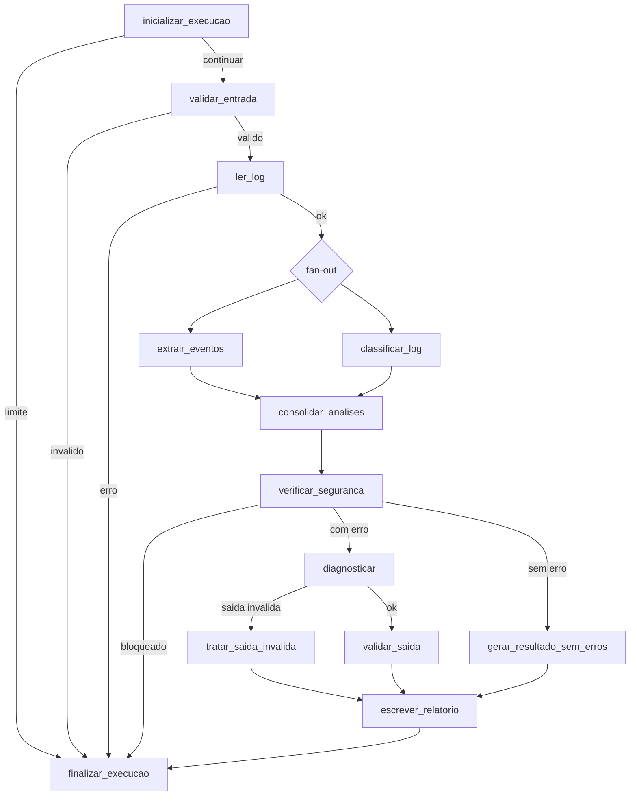

# Arquitetura

Como o JavaLog Agent está montado: o fluxo, os nós, as rotas, a paralelização, a
condição de parada e as três fronteiras por onde ele é acionado.

## Classificação: sistema híbrido

O sistema é **híbrido**, e a distinção não é cosmética:

| Parte | Natureza |
|---|---|
| Validação de entrada, leitura confinada, extração de eventos, classificação, política de autonomia, métricas e emissão de sinais | **determinística** — mesma entrada, mesma saída, sem modelo |
| Redação do diagnóstico | **um único ponto de LLM**, opcional |

O modelo entra em **um** nó. Sem chave, sem rede ou diante de falha, o fluxo
segue por um fallback determinístico e **conclui do mesmo jeito** — muda a
qualidade da prosa do diagnóstico, não a capacidade do agente.

Não é um agente que decide livremente o próprio caminho: o grafo é explícito e as
rotas são condições sobre o estado. Também não é um workflow puro: há um ponto
onde um modelo produz conteúdo. Daí **híbrido**.

## O fluxo

### Os nós

| Nó | Responsabilidade |
|---|---|
| `inicializar_execucao` | prepara a execução, incrementa o passo e zera os campos que pertencem a uma execução só |
| `validar_entrada` | valida o caminho de forma determinística, antes de qualquer leitura |
| `ler_log` | lê o arquivo pela tool confinada a `examples/logs/` |
| `extrair_eventos` | extrai exceções Java e linhas `ERROR` e `WARN` |
| `classificar_log` | classifica o log em categoria, sem modelo |
| `consolidar_analises` | junta as duas análises paralelas |
| `verificar_seguranca` | avalia a política de autonomia sobre o conteúdo lido |
| `gerar_resultado_sem_erros` | monta o resultado quando não há erro a diagnosticar |
| `diagnosticar` | **único ponto de LLM**, com uma tentativa e sem retry |
| `tratar_saida_invalida` | fallback determinístico, preservando a causa técnica |
| `validar_saida` | valida o diagnóstico contra o contrato Pydantic |
| `escrever_relatorio` | grava o relatório, com escrita restrita a `output/` |
| `finalizar_execucao` | ponto **único** de término; emite os dois sinais |

### As quatro rotas condicionais

| Rota | Decide entre |
|---|---|
| `route_inicializar` | `limite` (parada) ou `continuar` |
| `route_validacao` | `invalido` (encerra) ou `valido` |
| `route_leitura` | `erro` (encerra) ou `ok` (abre o fan-out) |
| `route_seguranca_e_categoria` | `bloqueado`, `sem erro` ou `com erro` |

Há ainda a rota do diagnóstico, que separa saída válida de saída fora do schema.

### Paralelização — fan-out e fan-in

Depois da leitura, **`extrair_eventos` e `classificar_log` executam em paralelo**.
São independentes: um varre o texto atrás de eventos, o outro classifica o log
como um todo. `consolidar_analises` é o ponto de encontro — o fan-in — e o
reducer do estado mescla as duas contribuições **por origem**, de modo que a
ordem de chegada não altera o resultado.

### Condição de parada

`current_step >= max_steps` encerra a execução pelo caminho de término, sem
validar, ler, escrever nem chamar o modelo. A comparação é `>=`, e não `>`: com
`>`, o passo de número `max_steps` ainda executaria e o limite valeria na prática
como `max_steps + 1`.

### Ponto único de término

Toda rota — sucesso, erro, bloqueio, cancelamento ou limite — passa por
`finalizar_execucao`. É ali, e só ali, que os dois sinais são emitidos. Isso é o
que garante **uma linha por execução em cada sinal**, qualquer que tenha sido o
desfecho.

## Governança antes da decisão

`verificar_seguranca` fica **entre** o fan-in e o diagnóstico. A ordem é
deliberada: até esse ponto, tudo o que aconteceu foi validação de caminho e
leitura confinada; a partir dali, o conteúdo do arquivo passaria a influenciar o
que o agente faz. O bloqueio é o ponto em que essa influência é examinada — e é
determinístico, sem depender de modelo, rede ou chave.

Bloqueado o fluxo, nada com efeito sobre o mundo externo executa depois: não há
chamada ao modelo, não há relatório de diagnóstico e não há ação externa. O que
ainda executa é `finalizar_execucao`, que **acrescenta uma linha a
`agent-events.jsonl` e outra a `agent-audit.jsonl`** — sem isso, um bloqueio
seria invisível na investigação.

## Estado compartilhado

O estado é tipado e trafega entre os nós. Campos com mais de um produtor usam
**reducers** que mesclam por origem, em vez de sobrescrever. Os campos que
pertencem a uma execução só — diagnóstico, relatório, erro, causa do fallback —
são zerados na entrada, para que a segunda execução de uma mesma thread não herde
o resultado da primeira.

## Memória por thread

O checkpointer do LangGraph guarda o estado por `thread_id`. Duas threads não se
enxergam. O identificador é normalizado na fachada e **tem precedência sobre o
`configurable` do chamador**, para que o identificador público e a chave real do
checkpointer sejam sempre o mesmo valor.

O que é recuperado da execução anterior entra no prompt como **texto de
evidência**, com teto de tamanho, e passa pela mesma redação de credenciais
aplicada ao restante. Não há RAG: a justificativa está no bloco 4 do `README.md`.

## As três fronteiras

O mesmo grafo é acionado por três caminhos, sem duplicação de lógica:

| Fronteira | Arquivo | Como expõe |
|---|---|---|
| **CLI** | `src/main.py` | `python -m src.main <arquivo>`; propaga `blocked` e `cancelled` com código de saída 1 |
| **API** | `src/api.py` | `GET /health`, tool read-only e `POST /api/v1/analyze` |
| **MCP** | `src/mcp_server.py` | servidor local por stdio, expondo **somente** a capability `read_log` |

A automação low-code entra por **fora** dessas três: o fluxo n8n chama a API como
qualquer outro cliente HTTP. Ver [`low-code/reproducao.md`](low-code/reproducao.md).

## Observabilidade

Dois sinais JSONL, correlacionados por `correlation_id` **e** `audit_id`:

| Sinal | Conteúdo |
|---|---|
| `output/agent-events.jsonl` | log estruturado de aplicação, com campo livre `details` |
| `output/agent-audit.jsonl` | registro de auditoria tipado, sem payload livre |

Ambos passam por redação recursiva antes da escrita, que é serializada por trava.
Falha de gravação **não derruba o fluxo**: é acumulada no estado.

## Segurança

| Controle | Onde |
|---|---|
| Leitura confinada a `examples/logs/`, escrita confinada a `output/` | `src/tools.py` |
| Validação determinística do caminho, antes de qualquer leitura | `src/validation.py` |
| Política de autonomia e três famílias de conteúdo hostil | `src/security.py` |
| Redação de dez formatos de credencial, antes de prompt, arquivo, sinal ou resposta | `src/security.py` |
| Chave em `SecretStr`, fora do repositório, nunca enviada ao modelo | `src/config.py` |

Detalhes em [`seguranca/politica-autonomia.md`](seguranca/politica-autonomia.md)
e [`seguranca/cenario-adversarial.md`](seguranca/cenario-adversarial.md).

## O que a arquitetura deliberadamente não tem

- **sem camada de abstração extra**: não há repositório, serviço nem factory
  entre o grafo e as funções que ele chama. Cada arquivo tem uma
  responsabilidade e é lido de cima a baixo;
- **sem retry no modelo**: uma tentativa, `max_retries=0`. Repetir uma chamada
  que falhou por timeout ou chave ausente só atrasa o fallback;
- **sem persistência em disco da memória**: o checkpointer vive em processo. É
  limitação declarada, não descuido — ver o bloco 10 do `README.md`.
